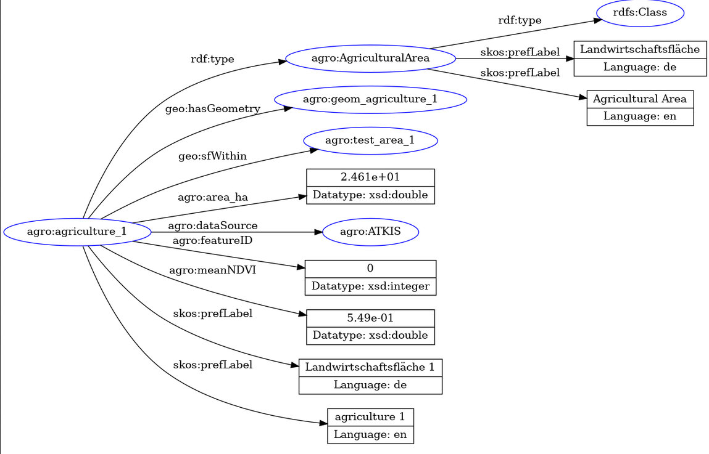

# agro-geokg: End-to-end geospatial Knowledge Graph workflow from raw GIS data to semantic querying using Python and RDF.


Knowledge Graph–based Planning and Analysis of Agricultural Infrastructure

This project is a prototype that **links spatial data (fields, OSM roads, NDVI raster) with semantic knowledge**.  
The goal is to enable complex spatial-semantic queries, e.g.:

- Which roads are located within specific test areas?
- Average NDVI of agricultural plots
- Which areas lie within defined zones?

The workflow starts with raw geospatial datasets, enriches them with NDVI information, converts them into RDF, and enables semantic querying using SPARQL.

---
## Features

- Integration of GeoJSON, raster, and RDF data

- Creation of a semantic knowledge graph
- Calculation of average NDVI values per agriculture area
- Linking of spatial and semantic information

- SPARQL and GeoSPARQL queries

- Interactive visualization with Folium
---
## Example Geospatial Analysis




---
---
## Example final knowledge Graph

---
---
## Components

- **Data Storage:** GeoJSON, Raster Data, RDF/Turtle
- **Ontologies:** Custom OWL Domain Ontology, SKOS Concepts

- **Integration:** Python (GeoPandas, Rasterio, RDFLib, Folium)

- **Querying:** SPARQL, GeoSPARQL

- **Visualization:** Folium, Matplotlib, Jupyter Notebooks

---

## Jupyter Notebooks

| Notebook | Description |
|----------|-------------|
| 01 | NDVI analysis and visualization |
| 02 | Convert agricultural polygons to RDF |
| 03 | Convert OSM road network to RDF |
| 04 | Convert test area to RDF |
| 05 | Merge RDF datasets into one Knowledge Graph |
| 06 | Enrich agricultural RDF with triples containing NDVI information |
| 07 | Execute SPARQL queries |
---

---

GeoJSON
        \
Raster -----> Python -----> RDF 
        /                     |
OSM --------------------------+
                              |
                           SPARQL
                              |
                         Folium Maps
---
## Example SPARQL Query

```sparql
SELECT ?field ?ndvi
WHERE {
    ?field rdf:type agro:AgriculturalArea .
    ?field agro:meanNDVI ?ndvi .
}
ORDER BY DESC(?ndvi)
```
## Results

The prototype demonstrates how geospatial and semantic technologies can be combined to support spatial decision making.

The resulting Knowledge Graph enables:

- semantic querying with SPARQL
- integration of heterogeneous geospatial data
- enrichment of spatial objects with NDVI information
- interactive visualization of analysis results

---

---
## Folder Structure

- `data/` → GIS data (raw & processed)  
- `ontology/` → OWL ontology(ies)  
- `notebooks/` → Jupyter notebooks (NDVI, RDF, visualization)  
- `scripts/` → Python scripts for ETL & SPARQL queries  
- `docs/` → screenshots & technical documentation
---


---


