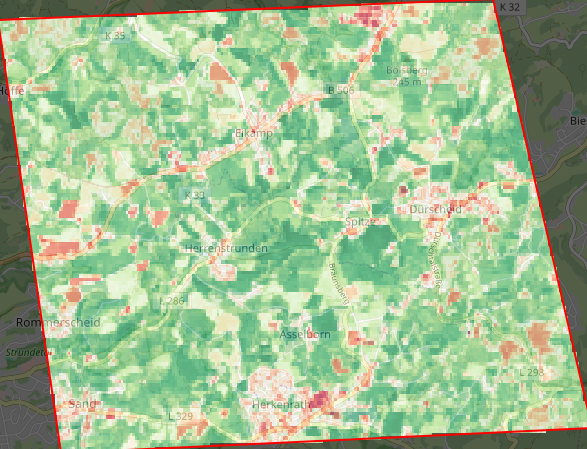
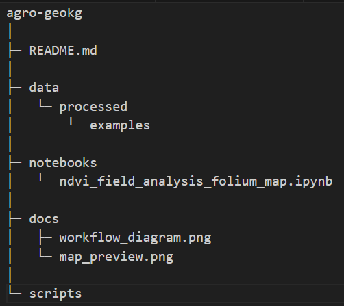
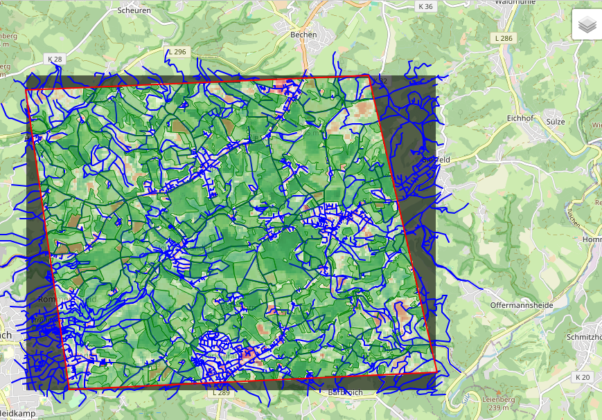

# agro-geokg

## DEUTSCH

Wissensgraph-gestützte Planung und Analyse landwirtschaftlicher Infrastrukturen

Dieses Projekt ist ein Prototyp, der **räumliche Daten (Felder, OSM-Wege, NDVI-Raster) mit semantischem Wissen** verbindet.  
Ziel ist es, komplexe räumlich-semantische Abfragen zu ermöglichen, z. B.:

- Welche Wege liegen innerhalb bestimmter Testgebiete?
- Mittlerer NDVI auf landwirtschaftlichen Flächen?
- Welche Flächen liegen innerhalb bestimmter Gebiete?

---

## Beispielkarte

---

## Komponenten

- **Datenhaltung:** GeoJSON, Rasterdaten, RDF/Turtle, Blazegraph
- **Ontologien:** eigene OWL-Domänenontologie, SKOS-Konzepte
- **Integration:** Python (GeoPandas, rasterio, RDFLib, Folium)
- **Abfragen:** SPARQL, GeoSPARQL
- **Visualisierung:** Folium, Matplotlib, Jupyter Notebooks

---

## Ordnerstruktur

- `data/` → GIS-Daten (roh & verarbeitet)  
- `ontology/` → OWL Ontologie(n)  
- `notebooks/` → Jupyter-Notebooks (NDVI, RDF, Visualisierung)  
- `scripts/` → Python-Skripte für ETL & SPARQL-Abfragen  
- `docs/` → Screenshots & technische Dokumentation  

---

## ENGLISH

Knowledge Graph–based Planning and Analysis of Agricultural Infrastructure

This project is a prototype that **links spatial data (fields, OSM roads, NDVI raster) with semantic knowledge**.  
The goal is to enable complex spatial-semantic queries, e.g.:

- Which roads are located within specific test areas?
- Average NDVI of agricultural plots
- Which areas lie within defined zones?

---

## Example Map

---

## Components

- **Data storage:** GeoJSON, raster data, RDF/Turtle, Blazegraph
- **Ontologies:** custom OWL domain ontology, SKOS concepts
- **Integration:** Python (GeoPandas, rasterio, RDFLib, Folium)
- **Queries:** SPARQL, GeoSPARQL
- **Visualization:** Folium, Matplotlib, Jupyter Notebooks

---

## Folder Structure

- `data/` → GIS data (raw & processed)  
- `ontology/` → OWL ontology(ies)  
- `notebooks/` → Jupyter notebooks (NDVI, RDF, visualization)  
- `scripts/` → Python scripts for ETL & SPARQL queries  
- `docs/` → screenshots & technical documentation

## Example Geospatial Workflow

This repository also contains example geospatial analyses implemented in Python.

### NDVI Field Analysis

This notebook demonstrates a small geospatial workflow:

1. Load agricultural field polygons and OSM road data  
2. Calculate mean NDVI values for agricultural fields  
3. Reproject raster data for web visualization  
4. Create an interactive map using Folium

### Workflow

### Example Output

