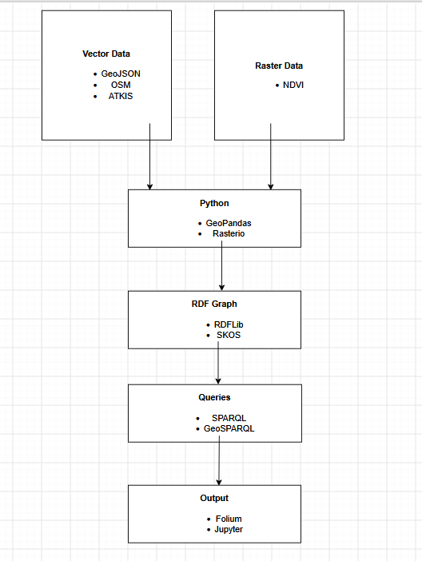

# agro-geokg: End-to-end geospatial Knowledge Graph workflow from raw GIS data to semantic querying using Python and RDF.


Knowledge Graph-based Planning and Analysis of Agricultural Infrastructure

This project is a prototype that **links spatial data (fields, OSM roads, NDVI raster) with semantic knowledge**.  
The goal is to enable complex spatial-semantic queries, e.g.:

- Which roads are located within specific test areas?
- Average NDVI of agricultural plots
- Which areas lie within defined zones?

The workflow starts with raw geospatial datasets, enriches them with NDVI information, converts them into RDF, and enables semantic querying using SPARQL.

---
## Features

- Integration of GeoJSON, raster, and RDF data

- Creation of a semantic knowledge graph
- Calculation of average NDVI values per agriculture area
- Linking of spatial and semantic information

- SPARQL and GeoSPARQL queries

- Interactive visualization with Folium
---

## Study area and input datasets
The project uses a defined test area to demonstrate the integration of different geospatial datasets. The interactive web map provides an overview of the spatial input layers used in the workflow, including agricultural areas, infrastructure data, and raster-derived information. Individual layers can be activated or deactivated to explore the different data sources separately.


*Figure 1: Interactive web map of the study area with all available data layers enabled. The layer control allows users to toggle individual datasets on and off, providing a flexible way to inspect the spatial relationships between the input data sources.*


---
## Consolidated RDF knowledge graph

After integrating the RDF triples generated from vector and raster datasets, a consolidated knowledge graph was created in Turtle format. The following excerpt illustrates the definition of an ontology class and one of its instances. The graph visualization highlights the semantic relationships between the resources.


*Figure 2: Excerpt from the generated RDF knowledge graph in Turtle format. The RDF class agro:AgriculturalArea is defined first, followed by the instance agro:agriculture_1. Besides its class membership (rdf:type), the resource contains semantic and spatial properties, including its geometry (geo:hasGeometry), spatial relation to the study area (geo:sfWithin), area size, data source, and the calculated mean NDVI value.*


*Figure 3: Visualization of the RDF knowledge graph. The graph illustrates the distinction between the ontology (schema) and the instance (data) level. agro:AgriculturalArea is defined as an ontology class (rdf:type rdfs:Class), while agro:agriculture_1 is modeled as an instance of this class. Additional relationships connect the resource to its geometry, study area, and descriptive attributes.*

---
## Components

- **Data Storage:** GeoJSON, Raster Data, RDF/Turtle

- **Ontology and vocabularies:** Custom RDF/RDFS definitions, SKOS concepts

- **Integration:** Python (GeoPandas, Rasterio, RDFLib, Folium)

- **Querying:** SPARQL, GeoSPARQL

- **Visualization:** Folium, Matplotlib, Jupyter Notebooks

---

## Jupyter Notebooks

| Notebook | Description |
|----------|-------------|
| 01 | NDVI analysis and visualization |
| 02 | Convert agricultural polygons to RDF |
| 03 | Convert OSM road network to RDF |
| 04 | Convert test area to RDF |
| 05 | Merge RDF datasets into one Knowledge Graph |
| 06 | Enrich agricultural RDF with triples containing NDVI information |
| 07 | Execute SPARQL queries |
---


## Workflow overview
The following diagram illustrates the complete data processing workflow, from geospatial data sources to the final semantic knowledge graph. It shows the integration of vector data, raster analysis, RDF generation, and semantic querying.


*Figure 4: Workflow of the agro-geokg pipeline. Geospatial vector and raster datasets are processed, transformed into RDF representations, and combined into a semantic knowledge graph that can be queried using SPARQL.*

## Example SPARQL Query

```sparql
SELECT ?field ?ndvi
WHERE {
    ?field rdf:type agro:AgriculturalArea .
    ?field agro:meanNDVI ?ndvi .
}
ORDER BY DESC(?ndvi)
```
The query retrieves agricultural areas and their associated mean NDVI values from the knowledge graph. The output is sorted by NDVI value in descending order, highlighting areas with higher vegetation activity.

Example output:

| field | ndvi |
|---|---|
| agro:agriculture_42 | 0.71 |
| agro:agriculture_15 | 0.68 |
| agro:agriculture_103 | 0.64 |

## Results

The prototype demonstrates how geospatial and semantic technologies can be combined to support spatial decision making.

The resulting Knowledge Graph enables:

- semantic querying with SPARQL
- integration of heterogeneous geospatial data
- enrichment of spatial objects with NDVI information
- interactive visualization of analysis results

---

---
## Folder Structure

- `data/` → GIS data (raw & processed)  
- `ontology/` → semantic definitions and vocabularies (RDF/RDFS vocabulary definitions)
- `notebooks/` → Jupyter notebooks (NDVI, RDF generation, visualization)  
- `scripts/` → Python scripts for ETL & SPARQL queries  
- `docs/` → screenshots & technical documentation


---


